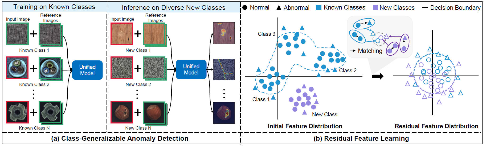

## ResAD: A Simple Framework for Class Generalizable Anomaly Detection (NeurIPS Spotlight, 2024)

PyTorch implementation for NeurIPS 2024 spotlight paper, ResAD: A Simple Framework for Class Generalizable Anomaly Detection ([https://arxiv.org/abs/2410.20047](https://arxiv.org/abs/2410.20047)).


Intuitive illustration of class-generalizable anomaly detection and conceptual illustration of residual feature learning:



---

**Update: The code in this repository is not exactly the same with the method in the NeurIPS conference paper. We further improved the method and open-source the improved code, which can achieve better performance and is also more robust. For more details, please see our journal version paper (due to some review reasons, the journal version paper is not currently open for access).**

## Installation
Install all packages (the same version with ours) by the following command:
```
$ pip3 install -r requirements.txt
```

## Download Few-Shot Reference Samples
First, You need to download the few-shot reference normal samples. Please download the few-shot normal reference samples from [Data](https://huggingface.co/datasets/xcyao00/resad-data/tree/main) and put the data in the `./data` directory.

## Download Datasets
Please download MVTecAD dataset from [MVTecAD dataset](https://www.mvtec.com/de/unternehmen/forschung/datasets/mvtec-ad/), VisA dataset from [VisA dataset](https://amazon-visual-anomaly.s3.us-west-2.amazonaws.com/VisA_20220922.tar), BTAD dataset from [BTAD dataset](http://avires.dimi.uniud.it/papers/btad/btad.zip), and MVTec3D dataset from [MVTec3D dataset](https://www.mvtec.com/company/research/datasets/mvtec-3d-ad), MPDD dataset from [MPDD dataset](https://github.com/stepanje/MPDD), MVTecLOCO dataset from [MVTecLOCO dataset](https://www.mvtec.com/company/research/datasets/mvtec-loco), BraTS dataset from [BraTS dataset](https://www.kaggle.com/datasets/dschettler8854/brats-2021-task1).

## Creating Reference Features
Please run the following code for extracting reference features used during testing as reference. 
```bash
# For MVTecAD
python extract_ref_features.py --dataset mvtec --few_shot_dir ./data/4shot/mvtec --save_dir ./ref_features/w50/mvtec_4shot 
# For BTAD
python extract_ref_features.py --dataset btad --few_shot_dir ./data/4shot/btad --save_dir ./ref_features/w50/btad_4shot 
# For VisA
python extract_ref_features.py --dataset visa --few_shot_dir ./data/4shot/visa --save_dir ./ref_features/w50/visa_4shot
# For MVTec3D
python extract_ref_features.py --dataset mvtec3d --few_shot_dir ./data/4shot/mvtec3d --save_dir ./ref_features/w50/mvtec3d_4shot
```


## Training and Evaluating
In this repository, we use ``wide_resnet50`` as the feature extractor by default.

- Run code for training and evaluating MVTecAD
```bash
python main.py --setting visa_to_mvtec --train_dataset_dir /path/to/your/dataset --test_dataset_dir /path/to/your/dataset  --test_ref_feature_dir ./ref_features/w50/mvtec_4shot --num_ref_shot 4 --device cuda:0
```
- Run code for training and evaluating BTAD
```bash
python main.py --setting mvtec_to_btad --train_dataset_dir /path/to/your/dataset --test_dataset_dir /path/to/your/dataset  --test_ref_feature_dir ./ref_features/w50/btad_4shot --num_ref_shot 4 --device cuda:0
```
- Run code for training and evaluating VisA
```bash
python main.py --setting mvtec_to_visa --train_dataset_dir /path/to/your/dataset --test_dataset_dir /path/to/your/dataset  --test_ref_feature_dir ./ref_features/w50/visa_4shot --num_ref_shot 4 --device cuda:0
```
- Run code for training and evaluating MVTec3D
```bash
python main.py --setting mvtec_to_mvtec3d --train_dataset_dir /path/to/your/dataset --test_dataset_dir /path/to/your/dataset  --test_ref_feature_dir ./ref_features/w50/mvtec3d_4shot --num_ref_shot 4 --device cuda:0
```
Please note that the ``--num_ref_shot`` should be less than or equal to 4, as we only extract reference features with 4-shot reference samples.

Normally, you can obtain the following results (under 4-shot setting; please run sufficiently, about 60 epochs):
| Dataset | Image AUC | Pixel AUC | 
|:------------:|:--------:|:----------:|
| MVTecAD | 91.0 | 96.0 |
| VisA | 89.4 | 96.8 | 
| BTAD | 94.7 | 97.2 |
| MVTec3D | 72.0 | 97.7 | 

We also provide a script ``main_all.py`` for testing 2, 4, and 8 shot settings simultaneously. You need to extract reference features with 8-shot samples in the ./data/8shot directory. The command is:
```bash
# Extract reference features
python extract_ref_features.py --dataset mvtec --few_shot_dir ./data/8shot/mvtec --save_dir ./ref_features/w50/mvtec_8shot 
# Training and evaluating
python main_all.py --setting visa_to_mvtec --train_dataset_dir /path/to/your/dataset --test_dataset_dir /path/to/your/dataset  --test_ref_feature_dir ./ref_features/w50/mvtec_8shot --device cuda:0
```


### Download ImageBind Checkpoint

For Imagebind as feature extractor, you can download the pre-trained ImageBind model from [this link](https://dl.fbaipublicfiles.com/imagebind/imagebind_huge.pth). After downloading, please put the downloaded file (imagebind_huge.pth) in `./pretrained_weights/imagebind/` directory. For creating reference features, please replace the main() function with main2() in extract_ref_features.py script, the running code is similar. For training and evaluating, please replace main.py with main_ib.py in above running command.
- Run code for training and evaluating MVTecAD
```bash
python main_ib.py --setting visa_to_mvtec --train_dataset_dir /path/to/your/dataset --test_dataset_dir /path/to/your/dataset  --test_ref_feature_dir ./ref_features/ib/mvtec_4shot --num_ref_shot 4 --device cuda:0
```

## Citation

If you find this repository useful, please consider citing our work:
```
@article{ResAD,
      title={ResAD: A Simple Framework for Class Generalizable Anomaly Detection}, 
      author={Xincheng Yao and Zixin Chen and Gao Chao and Guangtao Zhai and Chongyang Zhang},
      year={2024},
      booktitle={Thirty-Eighth Annual Conference on Neural Information Processing Systems, NeurIPS 2024},
      url={https://arxiv.org/abs/2410.20047},
      primaryClass={cs.CV}
}
```

If you are interested in our work, you can also follow our previous works: [BGAD (CVPR2023)](https://github.com/xcyao00/BGAD), [PMAD (AAAI2023)](https://github.com/xcyao00/PMAD), [FOD (ICCV2023)](https://github.com/xcyao00/FOD), [HGAD (ECCV2024)](https://github.com/xcyao00/HGAD). Or, you can follow our github page [xcyao00](https://github.com/xcyao00).


